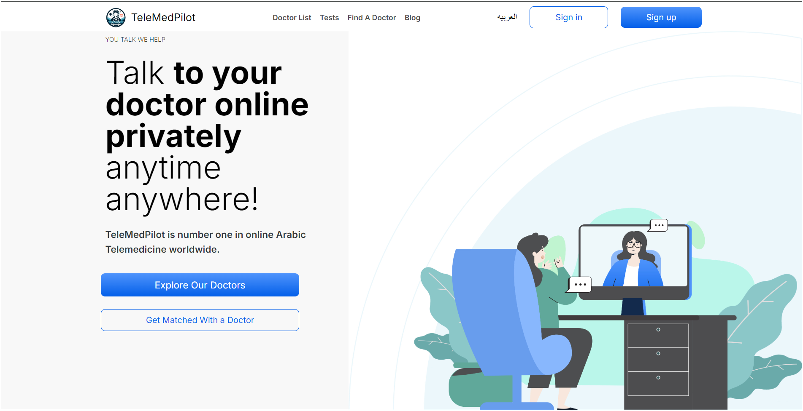

<div style="display: flex;flex-direction: row; align-items: center; justify-content: center;">
  
</div>

# Telemedicine App


## **Your Virtual Healthcare Companion**

A telemedicine platform designed to connect patients with certified doctors via secure online consultations. It simplifies healthcare by offering features such as video calls, appointment booking, secure messaging, and medical record management, making healthcare more accessible and convenient.

---


## [Live Demo](https://telemedicine-mansy.vercel.app)
## [Video Demo](https://drive.google.com/file/d/1jLJBq4sM2xFOySg1NZpFaYpqA95pb9vL/view?usp=sharing)



> Home page showcasing the doctor search and booking functionality.

## Features

- Video Calls (Agora): Seamless video consultations between doctors and patients.
- Doctor and Patient Signup: Doctors can manage their availability, and patients can easily book appointments.
- Appointment Scheduling: Doctors can add, edit, or delete time slots, while patients can browse available slots and book appointments.
- Medical Records: Patients have access to their prescriptions, test results, and visit history.
- Secure Messaging: Patients can communicate with doctors for follow-ups or additional questions.

## **Why Choose TeleMedPilot?**

- **Flexible Appointments:** Book online or in-person consultations at your convenience.
- **Doctor Search & Filters:** Find the right doctor based on specialty, experience, and availability.
- **Personalized Care:** Get customized treatment plans and prescriptions.
- **Secure Communication:** Send messages securely to your doctor for follow-ups or additional questions.
- **Medical Record Management:** Easily access and manage your prescriptions, test results, and visit history.

---

## **How TeleMedPilot Works**

1. **Create an Account:** Sign up and set up your profile.
2. **Book an Appointment:** Search for doctors and choose a time that works for you.
3. **Consult Online:** Meet with your doctor via video or phone.
4. **Receive Treatment:** Get a diagnosis and personalized treatment plan.
5. **Access Medical Records:** Safely manage your prescriptions and visit history online.

---

## **Live Demo**

Visit the live website: [TeleMedPilot](https://telemedicine-mansy.vercel.app)

---

## **Technology Stack**

- **Frontend:** Next.js (with TypeScript)
- **Backend:** Node.js, Express
- **Mobile:** Flutter
- **Database:** MongoDB
- **Cloud Services:** AWS for hosting and data storage
- **Video Conferencing:** WebRTC for seamless online consultations

---
## **Technologies Used (Frontend)**

- **Next.js (TypeScript):** For building user interfaces.
- **Tailwind CSS:** For styling and responsive design.
- **Custom Hooks:** For efficient state management.
- **Git:** Version control.
- **Responsive Design:** Optimized for mobile and desktop experiences.

---

## **Learnings from This Project**

In this project, I learned how to effectively manage:

1. **Team Communication:**
   Working in an Agile team with daily standups and sprints helped keep the project on track and enabled quick problem resolution.

2. **API Integration:**
   I handled intensive API integrations, debugging common issues like CORS and authentication, and ensuring real-time data sync between frontend and backend.

---

## **Acknowledgements**

Special thanks to the TeleMedPilot team for their dedication to building this platform. The project wouldn't have been possible without contributions from:

- **Frontend Team:** UI/UX development and responsive design.
- **Backend Team:** API integrations and data security.
- **Cloud Engineers:** Ensuring smooth deployment and scalability.
- **Mobile App Team**

---
### **Installation for Developers**

1. **Clone the repository:**

   ```bash
   git clone https://github.com/innovay.io/TeleMedPilot.git
   ```

2. **Install dependencies:**

   ```bash
   npm install
   ```

3. **Environment Setup:**

   Create a `.env` file and add necessary environment variables (API keys, database connection strings, etc.).

---

### **Running the App**

1. **Start Development Server:**

   ```bash
   npm run dev
   ```

2. **Build for Production:**

   ```bash
   npm run build
   ```

---

### **TeleMedPilot Architecture**

#### **High-Level Overview**

TeleMedPilot is built on a robust microservice architecture, enabling scalability and fault tolerance. Key components include:

- **Frontend:** A responsive UI developed using Next.js and Tailwind CSS.
- **Backend Services:** Node.js API gateway for handling authentication, booking, and medical records.
- **Database:** MongoDB for efficient storage and retrieval of patient data.
- **Video Conferencing:** Real-time video calls managed through WebRTC, providing low-latency communication between patients and doctors.

---

### **Data Model Design**

TeleMedPilot follows a modular data structure to accommodate patient-doctor interactions:

- **Users (Patients, Doctors, Admins)**: Stores user profile details, including role-based access.
- **Appointments**: Tracks bookings, appointment times, and medical summaries.
- **Medical Records**: Securely manages patient history, prescriptions, and test results.


---   
### **Endnote**

This project was both challenging and rewarding, pushing my skills in state management, API integration, and teamwork. Looking forward to sharing more in future projects!

## **Contact Information**

- **Author:** [Mahmoud Mansy](https://github.com/MMansy19)
- **Portfolio:** [My Portfolio](https://mahmoud-mansy-portfolio.netlify.app/)
- **Email:** [mahmoud2abdalfattah@gmail.com](mailto:mahmoud2abdalfattah@gmail.com)
- **LinkedIn:** [Mahmoud Mansy](https://www.linkedin.com/in/mahmoud-mansy-a189a5232)

---


